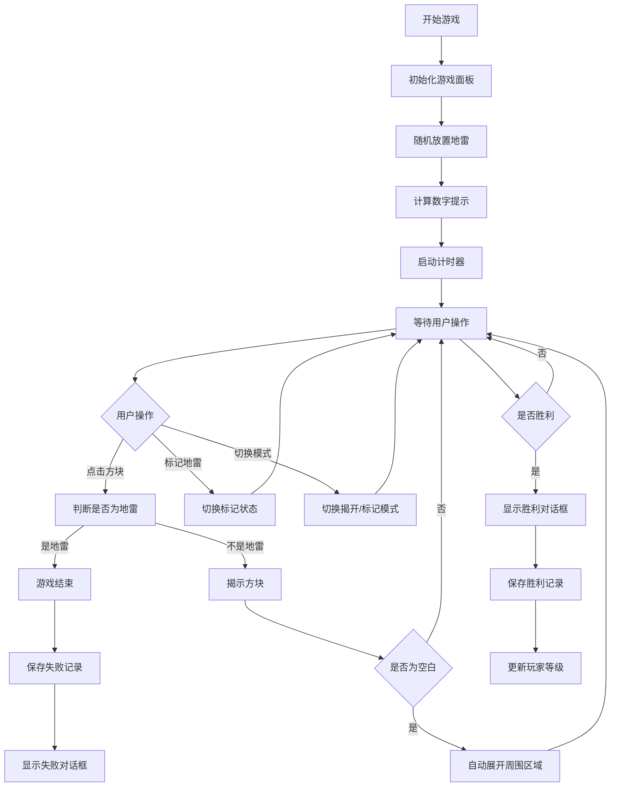
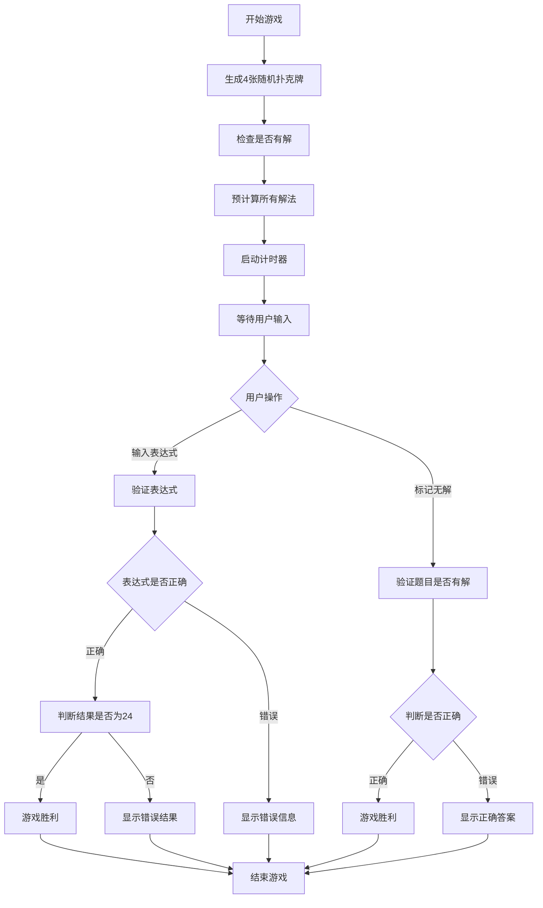

# HarmonyOS 经典小游戏合集 🎮

<p align="center">
  
</p>

<p align="center">
  <a href="https://gitee.com/NissonCX/CQU-ArkTS-Course-Exp">
    
  </a>
  <a href="LICENSE">
    
  </a>
  <a href="https://github.com/NissonCX/CQU-ArkTS-Course-Exp">
    
  </a>
</p>

> 基于 HarmonyOS 和 ArkTS 开发的经典益智游戏合集，包含扫雷、24点等多种趣味游戏

## 📋 目录

- [项目简介](#项目简介)
- [游戏特色](#游戏特色)
- [技术架构](#技术架构)
- [快速开始](#快速开始)
- [项目结构](#项目结构)
- [核心功能详解](#核心功能详解)
- [开发规范](#开发规范)
- [未来规划](#未来规划)
- [许可证](#许可证)
- [作者](#作者)

## 项目简介

本项目是基于华为 HarmonyOS 平台开发的经典小游戏合集，采用 ArkTS 语言进行开发。项目旨在提供多种经典益智游戏，帮助用户在闲暇时光锻炼逻辑思维能力和数学计算能力。

目前包含的游戏：
- 扫雷游戏 (Minesweeper) - ✅ 已完成
- 24点游戏 (24 Points) - ✅ 已完成
- 2048游戏 - 🚧 开发中

## 1. 软件功能

### 🧩 扫雷游戏 (Minesweeper)

一款经典的逻辑推理游戏，玩家需要根据数字提示找出所有地雷的位置。

主要功能：
- 10x10 的游戏网格布局，共10个随机分布的地雷
- 双模式操作：揭开模式 / 标记模式
- 通过切换操作模式来控制点击行为（点击在揭开模式下揭开方块，在标记模式下标记地雷）
- 智能展开：点击空白区域可自动展开周围区域
- 实时计时功能，记录您的挑战时间
- 胜负判断与游戏结果提示
- 重新开始功能
- 游戏战绩记录功能，支持查看历史记录和玩家等级

游戏交互亮点：
- 注重用户交互体验，特别针对手机端操作优化
- 利用切换揭开模式来防误触，非常好的规避了手机端容易误触的问题
- 双模式操作设计，用户可以方便地在"揭开"和"标记"模式间切换
- 智能防误触机制，有效减少误操作带来的游戏体验下降
- 清晰的模式指示，让用户始终了解当前操作模式

游戏界面特色：
- 现代化毛玻璃视觉风格设计
- 使用阴影和圆角增强界面层次感
- 采用 emoji 图标（🚩💣⏱）增强视觉表现力
- 精心调配的配色方案，追求专业和美观的界面
- 响应式布局适配不同屏幕尺寸
- 支持明暗主题切换

### 🃏 24点游戏 (24 Points)

一款经典的数学计算游戏，通过四则运算使四个数字的结果等于24。

主要功能：
- 随机生成四张扑克牌
- 支持加减乘除和括号运算
- 智能表达式验证系统
- 实时计时功能，记录您的挑战时间
- 无解判断功能
- 参考答案查看功能（通过优美弹窗展示）
- 重新开始功能

游戏界面特色：
- 现代化毛玻璃视觉风格设计
- 使用阴影和圆角增强界面层次感
- 采用 emoji 图标（🃏⏱）增强视觉表现力
- 拉长计时部分，突出时间信息
- 精心调配的配色方案，追求专业和美观的界面
- 响应式布局适配不同屏幕尺寸
- 美观的弹窗式答案展示
- 支持明暗主题切换

### 🔢 2048游戏

一款风靡全球的数字合成游戏，通过滑动合并相同数字方块。

当前状态：开发中...

## 2. 特色或创新点

### 🎨 界面设计创新

1. **现代化视觉风格**：采用毛玻璃设计风格，增强界面层次感
2. **Emoji图标应用**：使用emoji图标替代传统文字标识，提升界面现代感和视觉表现力
3. **拉长计时部分**：突出时间信息，增强用户对游戏时间的感知
4. **精心调配的配色方案**：追求专业和美观的界面，具有视觉冲击力
5. **响应式布局**：适配不同屏幕尺寸，提供一致的用户体验
6. **明暗主题切换**：支持全局明暗主题切换，满足不同用户偏好

### 🎮 交互体验创新

1. **扫雷双模式操作**：通过切换揭开/标记模式来控制点击行为，有效防止误触
2. **智能展开功能**：扫雷游戏中点击空白区域可自动展开周围区域
3. **表达式智能验证**：24点游戏中支持多种符号输入并自动转换
4. **无解判断机制**：24点游戏中玩家可以判断题目是否有解，增加游戏策略性
5. **游戏战绩记录**：扫雷游戏支持战绩记录和玩家等级系统

### 💡 技术实现创新

1. **统一主题管理**：实现全局主题状态管理，支持一键切换明暗主题
2. **模块化设计**：采用面向对象设计，将游戏逻辑和数据模型分离
3. **自定义表达式解析**：实现安全的数学表达式解析和计算算法
4. **响应式状态管理**：充分利用ArkTS的状态管理机制实现复杂交互

## 3. 设计思想（思路）

### 整体设计思路

本项目以"经典游戏现代化体验"为核心设计理念，旨在通过现代化的UI设计和优化的交互体验，让用户在移动设备上也能享受到经典益智游戏的乐趣。

1. **用户为中心的设计**：注重用户体验，特别是在移动设备上的操作便利性，如扫雷游戏的双模式操作设计有效防止误触。

2. **现代化视觉风格**：采用流行的毛玻璃设计风格，结合emoji图标和精心调配的配色方案，打造具有现代感和专业感的界面。

3. **模块化架构设计**：将游戏逻辑、数据模型和界面展示分离，提高代码的可维护性和可扩展性。

4. **统一的设计语言**：所有游戏采用统一的设计风格和交互模式，提供一致的用户体验。

5. **响应式设计**：适配不同屏幕尺寸，确保在各种设备上都能提供良好的用户体验。

### 游戏特定设计思路

1. **扫雷游戏**：通过双模式操作设计解决移动设备上容易误触的问题，智能展开功能提升游戏效率。

2. **24点游戏**：支持多种符号输入并自动转换，降低用户学习成本；无解判断机制增加游戏策略性。

## 4. 技术要点

### 开发技术栈

- **编程语言**: ArkTS (Ark TypeScript)
- **开发框架**: HarmonyOS API
- **构建工具**: DevEco Studio
- **UI 框架**: ArkUI
- **状态管理**: @State、@ObservedV2、@Trace 等装饰器

### 核心技术点

1. **响应式 UI 设计**：使用 ArkUI 构建流畅的用户界面
2. **状态管理**：利用 ArkTS 的状态管理机制实现复杂交互
3. **面向对象设计**：通过类封装游戏逻辑和数据模型
4. **路由导航**：实现页面间跳转与参数传递
5. **事件处理**：处理用户交互事件如点击、长按等
6. **定时器管理**：实现精确的计时功能
7. **表达式解析**：自定义算法解析和计算数学表达式
8. **弹窗交互**：使用系统弹窗增强用户体验
9. **主题管理**：实现全局明暗主题切换功能

### 项目关键类

- [Cell](entry/src/main/ets/model/Cell.ets): 扫雷游戏中单个格子的数据模型
- [Card](entry/src/main/ets/model/Card.ets): 24点游戏中扑克牌的数据模型
- [Game24Logic](entry/src/main/ets/model/Game24Logic.ets): 24点游戏核心逻辑实现
- [ExpressionEvaluator](entry/src/main/ets/utils/ExpressionEvaluator.ets): 表达式计算工具
- [ThemeManager](entry/src/main/ets/model/ThemeManager.ets): 主题管理器
- [Theme](entry/src/main/ets/model/Theme.ets): 主题配置类
- [Index](entry/src/main/ets/pages/Index.ets): 应用主页，展示游戏列表
- [Minesweeper](entry/src/main/ets/pages/Minesweeper.ets): 扫雷游戏主界面与核心逻辑
- [Game24Points](entry/src/main/ets/pages/24Points.ets): 24点游戏界面
- [Game2048](entry/src/main/ets/pages/2048.ets): 2048游戏界面（开发中）

## 5. 程序的结构

```
.
├── AppScope                      # 全局资源目录
│   └── resources                 # 全局资源文件
├── entry                         # 主模块目录
│   ├── src                       # 源代码目录
│   │   ├── main                  # 主代码目录
│   │   │   ├── ets               # ArkTS 代码
│   │   │   │   ├── entryability  # 应用生命周期管理
│   │   │   │   ├── model         # 数据模型
│   │   │   │   ├── pages         # 页面组件
│   │   │   │   └── utils         # 工具类
│   │   │   └── resources         # 模块资源
│   │   └── ohosTest              # 测试代码
│   └── build-profile.json5       # 模块配置文件
├── hvigor                       # 构建脚本
├── build-profile.json5          # 项目配置文件
├── hvigorfile.ts                # 项目级构建脚本
├── oh-package.json5             # 项目依赖配置
└── README.md                    # 项目说明文档
```

### 核心页面

- [`Index.ets`](entry/src/main/ets/pages/Index.ets) - 应用主页，展示游戏列表
- [`Minesweeper.ets`](entry/src/main/ets/pages/Minesweeper.ets) - 扫雷游戏主页面
- [`24Points.ets`](entry/src/main/ets/pages/24Points.ets) - 24点游戏页面
- [`2048.ets`](entry/src/main/ets/pages/2048.ets) - 2048游戏页面（开发中）
- [`MinesweeperRecords.ets`](entry/src/main/ets/pages/MinesweeperRecords.ets) - 扫雷游戏战绩记录页面

### 数据模型

- [`Cell.ets`](entry/src/main/ets/model/Cell.ets) - 扫雷游戏单元格数据模型
- [`Card.ets`](entry/src/main/ets/model/Card.ets) - 24点游戏扑克牌数据模型
- [`Game24Logic.ets`](entry/src/main/ets/model/Game24Logic.ets) - 24点游戏核心逻辑
- [`Theme.ets`](entry/src/main/ets/model/Theme.ets) - 主题配置类
- [`ThemeManager.ets`](entry/src/main/ets/model/ThemeManager.ets) - 主题管理器
- [`MinesweeperRecord.ets`](entry/src/main/ets/model/MinesweeperRecord.ets) - 扫雷游戏记录数据模型

### 工具类

- [`ExpressionEvaluator.ets`](entry/src/main/ets/utils/ExpressionEvaluator.ets) - 表达式计算工具
- [`MinesweeperStorage.ets`](entry/src/main/ets/utils/MinesweeperStorage.ets) - 扫雷游戏本地存储工具

## 6. 主要执行流程图

### 扫雷游戏执行流程



### 24点游戏执行流程



## 7. 模型的详细设计

### 7.1 数据模型设计

#### Cell 类 (扫雷游戏单元格)

[Cell.ets](entry/src/main/ets/model/Cell.ets) 类用于表示扫雷游戏中的单个单元格，包含以下属性：
- `row`: 行索引
- `col`: 列索引
- `hasMine`: 是否有地雷
- `neighborMines`: 周围地雷数量
- `isFlag`: 是否被标记为地雷

#### Card 类 (24点游戏扑克牌)

[Card.ets](entry/src/main/ets/model/Card.ets) 类用于表示24点游戏中的一张扑克牌，包含以下属性：
- `suit`: 花色 (红桃、方块、梅花、黑桃)
- `rank`: 点数 (A=1, J=11, Q=12, K=13)

#### MinesweeperRecord 类 (扫雷游戏记录)

[MinesweeperRecord.ets](entry/src/main/ets/model/MinesweeperRecord.ets) 类用于表示扫雷游戏的战绩记录，包含以下属性：
- `id`: 记录ID
- `time`: 游戏完成时间（秒）
- `timestamp`: 记录时间戳
- `isWin`: 是否胜利

### 7.2 逻辑模型设计

#### Game24Logic 类 (24点游戏核心逻辑)

[Game24Logic.ets](entry/src/main/ets/model/Game24Logic.ets) 类负责处理24点游戏的核心逻辑：
- `createDeck()`: 生成一副完整的扑克牌
- `dealFourCards()`: 随机抽取4张不重复的牌
- `canMake24()`: 检查给定的4个数字是否能通过基本运算得到24
- `getAllSolutions()`: 获取所有可能的解法
- `getSolvablePuzzle()`: 获取一个可解的24点题目

#### Theme 类 (主题配置)

[Theme.ets](entry/src/main/ets/model/Theme.ets) 类定义了主题相关的配置：
- `ThemeType`: 主题类型枚举（浅色/深色）
- `ThemeColors`: 主题颜色配置接口
- `ThemeConfig`: 主题配置类，包含浅色和深色主题的具体颜色值

#### ThemeManager 类 (主题管理器)

[ThemeManager.ets](entry/src/main/ets/model/ThemeManager.ets) 类使用单例模式管理全局主题状态：
- `getInstance()`: 获取主题管理器实例
- `getCurrentTheme()`: 获取当前主题
- `getCurrentColors()`: 获取当前主题的颜色配置
- `switchTheme()`: 切换主题
- `addThemeChangeListener()`: 添加主题变化监听器

### 7.3 工具类设计

#### ExpressionEvaluator 类 (表达式计算器)

[ExpressionEvaluator.ets](entry/src/main/ets/utils/ExpressionEvaluator.ets) 类用于解析和计算用户输入的数学表达式：
- `evaluate()`: 验证表达式是否合法并计算结果
- `extractNumbers()`: 从表达式中提取数字
- `calculateExpression()`: 计算数学表达式的结果

#### MinesweeperStorage 类 (扫雷游戏存储)

[MinesweeperStorage.ets](entry/src/main/ets/utils/MinesweeperStorage.ets) 类用于管理扫雷游戏的本地存储：
- `getInstance()`: 获取存储实例
- `initialize()`: 初始化存储
- `saveRecord()`: 保存游戏记录
- `getRecords()`: 获取游戏记录
- `clearRecords()`: 清除游戏记录

## 8. 界面的详细设计

### 8.1 主界面设计

主界面采用卡片式布局，展示所有游戏的入口。每个游戏以一个卡片形式展示，包含游戏图标、名称和简短描述。

关键组件：
- 主题切换按钮：支持明暗主题切换
- 游戏入口卡片：每个游戏一个入口卡片
- 统一的视觉风格：所有元素遵循统一的设计语言

### 8.2 扫雷游戏界面设计

扫雷游戏界面分为几个主要区域：

1. **标题区域**：包含返回按钮、游戏标题和模式说明
2. **计时区域**：显示当前游戏时间和玩家等级
3. **游戏区域**：10x10的游戏网格，每个格子显示相应内容
4. **控制区域**：包含模式切换按钮、战绩记录按钮和重新开始按钮
5. **底部信息区域**：显示游戏说明和制作人信息

视觉设计特点：
- 使用emoji图标增强视觉效果（🚩💣⏱）
- 现代化的卡片式设计
- 精心调配的配色方案，提升视觉体验
- 响应式布局适配不同屏幕尺寸
- 支持明暗主题切换

### 8.3 24点游戏界面设计

24点游戏界面分为几个主要区域：

1. **标题区域**：包含返回按钮、游戏标题和说明文字
2. **计时区域**：拉长设计，突出时间信息
3. **扑克牌区域**：显示当前的4张扑克牌
4. **输入区域**：包含输入提示、输入框和操作按钮
5. **解法展示区域**：以弹窗形式展示题目解法
6. **控制区域**：包含提交答案、标记无解和重新开始按钮
7. **底部信息区域**：显示游戏说明和制作人信息

视觉设计特点：
- 使用emoji图标增强视觉效果（🃏⏱）
- 拉长计时部分，突出时间信息
- 现代化的卡片式设计
- 精心调配的配色方案，提升视觉体验
- 美观的弹窗式答案展示
- 响应式布局适配不同屏幕尺寸
- 支持明暗主题切换

## 9. 其他

### 第三方工具和资源

1. **DevEco Studio**: 华为官方提供的HarmonyOS应用开发IDE
2. **HarmonyOS SDK**: 华为提供的开发工具包
3. **ArkUI**: 华为提供的UI开发框架
4. **Gitee**: 代码托管平台

### 重要资源

1. **图片资源**：项目中使用了52张扑克牌图片资源，分别对应四种花色的A-K
2. **主题配置**：定义了完整的明暗两套主题颜色配置
3. **游戏数据**：包含扫雷游戏战绩记录等持久化数据

### 开发规范

- 遵循 HarmonyOS 开发规范
- 保持代码风格一致
- 添加必要的注释说明
- 确保提交信息清晰明确

### Git 提交规范

- `feat`: 新功能
- `fix`: 修复bug
- `docs`: 文档更新
- `style`: 代码格式调整
- `refactor`: 代码重构
- `test`: 测试相关
- `chore`: 构建过程或辅助工具的变动

## 快速开始

### 环境准备

- 安装 [DevEco Studio 5.1.1.840](https://developer.harmonyos.com/cn/develop/deveco-studio) 或更高版本
- 配置 HarmonyOS SDK
- 准备支持 HarmonyOS 的设备或模拟器

### 运行项目

1. 克隆项目到本地：
   ```bash
   git clone git@gitee.com:NissonCX/CQU-ArkTS-Course-Exp.git
   ```

2. 使用 DevEco Studio 打开项目

3. 同步项目依赖：
   ```bash
   # 在 DevEco Studio 中执行同步操作
   ```

4. 编译并运行项目：
   - 连接设备或启动模拟器
   - 点击 Run 按钮运行应用

## 项目结构

```
.
├── AppScope                      # 全局资源目录
│   └── resources                 # 全局资源文件
├── entry                         # 主模块目录
│   ├── src                       # 源代码目录
│   │   ├── main                  # 主代码目录
│   │   │   ├── ets               # ArkTS 代码
│   │   │   │   ├── entryability  # 应用生命周期管理
│   │   │   │   ├── model         # 数据模型
│   │   │   │   ├── pages         # 页面组件
│   │   │   │   └── utils         # 工具类
│   │   │   └── resources         # 模块资源
│   │   └── ohosTest              # 测试代码
│   └── build-profile.json5       # 模块配置文件
├── hvigor                       # 构建脚本
├── build-profile.json5          # 项目配置文件
├── hvigorfile.ts                # 项目级构建脚本
├── oh-package.json5             # 项目依赖配置
└── README.md                    # 项目说明文档
```

### 核心页面

- [`Index.ets`](entry/src/main/ets/pages/Index.ets) - 应用主页，展示游戏列表
- [`Minesweeper.ets`](entry/src/main/ets/pages/Minesweeper.ets) - 扫雷游戏主页面
- [`24Points.ets`](entry/src/main/ets/pages/24Points.ets) - 24点游戏页面
- [`2048.ets`](entry/src/main/ets/pages/2048.ets) - 2048游戏页面（开发中）

### 数据模型

- [`Cell.ets`](entry/src/main/ets/model/Cell.ets) - 扫雷游戏单元格数据模型
- [`Card.ets`](entry/src/main/ets/model/Card.ets) - 24点游戏扑克牌数据模型
- [`Game24Logic.ets`](entry/src/main/ets/model/Game24Logic.ets) - 24点游戏核心逻辑
- [`Theme.ets`](entry/src/main/ets/model/Theme.ets) - 主题配置类
- [`ThemeManager.ets`](entry/src/main/ets/model/ThemeManager.ets) - 主题管理器

### 工具类

- [`ExpressionEvaluator.ets`](entry/src/main/ets/utils/ExpressionEvaluator.ets) - 表达式计算工具

## 核心功能详解

### 扫雷游戏实现细节

扫雷游戏是本项目的核心功能，具有完整的逻辑和美观的界面设计：

1. **游戏初始化**
   - 自动生成10x10的游戏网格
   - 随机分布10个地雷
   - 计算每个格子周围的地雷数量

2. **游戏交互**
   - 双模式操作：揭开模式 / 标记模式
   - 通过切换操作模式来控制点击行为（点击在揭开模式下揭开方块，在标记模式下标记地雷）
   - 智能展开功能：点击空白格子时自动展开周围区域

3. **游戏状态管理**
   - 实时计时功能，精确到秒
   - 胜负判断机制
   - 游戏结束对话框显示
   - 重新开始功能

4. **UI设计亮点**
   - 使用 emoji 图标增强视觉效果（🚩💣⏱）
   - 现代化的卡片式设计
   - 精心调配的配色方案，提升视觉体验
   - 响应式布局适配不同屏幕尺寸
   - 支持明暗主题切换

### 24点游戏实现细节

24点游戏是本项目的另一核心功能，具有智能的表达式验证和美观的界面设计：

1. **游戏初始化**
   - 随机生成四张扑克牌
   - 计算题目是否有解
   - 预先计算所有可能的解法

2. **表达式处理**
   - 支持多种运算符输入（×÷− 会自动转换为标准运算符）
   - 智能表达式解析和验证
   - 数字匹配验证（确保使用的是当前题目中的数字）
   - 结果计算和精度处理

3. **游戏交互**
   - 输入表达式并提交答案
   - 判断题目是否无解
   - 查看参考答案（通过美观弹窗展示）
   - 实时计时功能

4. **游戏状态管理**
   - 实时计时功能，精确到秒
   - 答案正确性判断
   - 无解判断正确性验证
   - 游戏结束状态管理

5. **UI设计亮点**
   - 使用 emoji 图标增强视觉效果（🃏⏱）
   - 现代化的卡片式设计
   - 精心调配的配色方案，提升视觉体验
   - 响应式布局适配不同屏幕尺寸
   - 美观的弹窗式答案展示
   - 支持明暗主题切换

### 界面设计规范

- 使用现代化的卡片式界面设计
- 采用 emoji 图标替代部分文字标识，增强视觉表现力
- 拉长计时部分，突出时间信息
- 使用具有视觉冲击力的配色方案，追求专业和美观的界面
- 统一的圆角和阴影设计，增强界面层次感
- 响应式布局适配不同屏幕尺寸
- 支持全局明暗主题切换

## 开发规范

### 代码规范

- 遵循 HarmonyOS 开发规范
- 保持代码风格一致
- 添加必要的注释说明
- 确保提交信息清晰明确

### Git 提交规范

- `feat`: 新功能
- `fix`: 修复bug
- `docs`: 文档更新
- `style`: 代码格式调整
- `refactor`: 代码重构
- `test`: 测试相关
- `chore`: 构建过程或辅助工具的变动

## 未来规划

- [ ] 完善 2048游戏功能
- [ ] 增加游戏难度选择
- [ ] 添加游戏音效
- [ ] 增加排行榜功能
- [ ] 支持多语言
- [ ] 优化UI/UX设计
- [ ] 增加更多经典小游戏

## 更新日志

### 2025-10-11

- 优化扫雷游戏战绩记录功能，支持记录失败结果
- 添加胜利率统计显示
- 实现历史记录滚动查看功能
- 美化战绩记录界面，使用emoji区分胜负结果
- 优化扫雷界面配色方案，提升视觉效果和可辨识度
- 调整按钮尺寸和间距，改善界面布局

## 许可证

本项目采用 MIT 许可证，详情请参阅 [LICENSE](LICENSE) 文件。

## 作者

**Nisson_CX**

- Gitee: [@NissonCX](https://gitee.com/NissonCX)

---

<p align="center">Made with ❤️ by Nisson_CX | 重庆大学ArkTS课程实验项目</p>